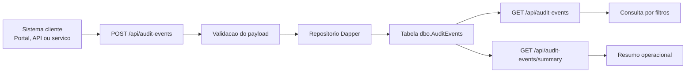

# AuditService.API

API em ASP.NET Core para registrar, consultar e resumir eventos de auditoria de multiplos sistemas em um ponto unico.

## Visao geral

Esse projeto simula um servico central de rastreabilidade. A ideia e receber eventos de diferentes aplicacoes, persistir em SQL Server e oferecer leitura rapida para suporte operacional, auditoria tecnica e cenarios de compliance.

## O que o projeto entrega

- Recebimento padronizado de eventos de auditoria
- Persistencia em SQL Server com Dapper
- Consulta com filtros por aplicacao, usuario, status e periodo
- Resumo rapido para analise operacional
- Swagger como camada visual para exploracao e teste
- Script SQL versionado para reproducao do banco

## Stack

- ASP.NET Core / .NET 9
- SQL Server
- Dapper
- Swagger / OpenAPI

## Fluxo visual



## Endpoints principais

- `POST /api/audit-events`
- `GET /api/audit-events`
- `GET /api/audit-events/{id}`
- `GET /api/audit-events/summary`
- `GET /healthz`

## Exemplo de payload

```json
{
  "applicationName": "PortalClinico",
  "usuario": "diogo.tognolli",
  "metodo": "POST",
  "endpoint": "/api/pacientes",
  "payloadRequest": "{ \"pacienteId\": 321 }",
  "payloadResponse": "{ \"success\": true }",
  "statusCode": 201,
  "correlationId": "req-2026-04-23-001",
  "severity": "Information",
  "notes": "Cadastro realizado com sucesso."
}
```

## Como isso aparece para quem entra no GitHub

Quem abrir o repositorio vai conseguir entender rapidamente:

1. Qual problema a API resolve
2. Como o fluxo funciona
3. Quais endpoints existem
4. Como testar pelo Swagger
5. Como a aplicacao se comporta com banco ativo ou indisponivel

Em outras palavras: mesmo sem rodar localmente, a pessoa ja enxerga que o projeto tem objetivo claro, arquitetura simples e comportamento previsivel.

## Comportamento esperado

### Cenario 1: API e banco disponiveis

- `GET /healthz` retorna `200`
- `POST /api/audit-events` grava o evento
- `GET /api/audit-events` lista os registros
- `GET /api/audit-events/summary` retorna um resumo agregado

Exemplo de resposta esperada no `POST`:

```json
{
  "id": 1,
  "message": "Evento de auditoria registrado com sucesso."
}
```

### Cenario 2: API no ar, mas banco indisponivel

- `GET /healthz` continua retornando `200`
- Swagger continua acessivel
- endpoints de auditoria retornam `503` com mensagem clara

Exemplo de resposta:

```json
{
  "message": "Nao foi possivel acessar o banco de auditoria.",
  "detail": "Erro de rede ou especifico a instancia ao estabelecer conexao com o SQL Server."
}
```

Esse comportamento foi mantido de proposito para demonstrar resiliencia minima: a API sobe, a documentacao abre e o erro operacional fica explicito.

## Como rodar

1. Ajuste `ConnectionStrings:DefaultConnection`
2. Use `appsettings.Local.example.json` como base para ambiente local
3. Rode `dotnet run`
4. Acesse `/swagger`
5. Opcionalmente execute `database/create-audit-table.sql` manualmente

Observacao:
Os endpoints de auditoria garantem a existencia da tabela `dbo.AuditEvents` quando o banco esta acessivel.

## Como testar visualmente

### Swagger

- suba a API com `dotnet run`
- abra `/swagger`
- envie o payload de exemplo em `POST /api/audit-events`
- consulte `GET /api/audit-events`
- abra `GET /api/audit-events/summary`

### Arquivo HTTP

O arquivo [AuditService.API.http](C:/Users/pekus/Desktop/github-audit/AuditService.API/AuditService.API.http) ja traz requests prontos para:

- health check
- criacao de evento
- listagem
- resumo

## Estrutura

- `Controllers/AuditEventsController.cs`: endpoints principais
- `Contracts`: payloads de entrada e filtros
- `Models`: entidades e resumo
- `Repositories`: persistencia com Dapper
- `database/create-audit-table.sql`: script versionado do schema

## Valor de portfolio

Esse projeto reforca um perfil back-end por mostrar:

- integracao com banco relacional
- rastreabilidade
- padronizacao de eventos
- filtros de consulta
- tratamento de indisponibilidade de infraestrutura
- preocupacao com observabilidade e suporte operacional
